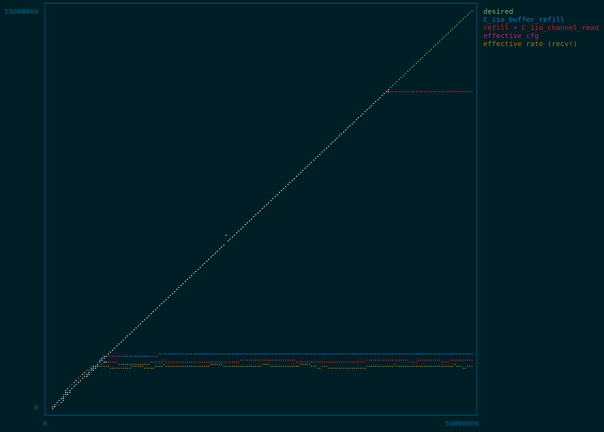

# PlutoSDR

## Documentation

The documentation is available on the [Github Pages](https://juliatelecom.github.io/AdalmPluto.jl/dev/).

## Basic usage

Using the radio through USB.

```jl
using AdalmPluto;

# Opening the radio with 100MHz carrier frequency, 3MHz sampling rate, and 64dB gain.
radio = openPluto(Int(100e6), Int(3e6), 64; bandwidth=Int(20e6));

# Receive the samples
sig = zeros(ComplexF32, 1024*1024) # 1 MiS buffer
recv!(sig, radio);

# Do some treatment
# ...
# ...

# Close the radio
close(radio);
```

## Running the examples

### FM Radio

This example records a few seconds of FM radio as WAV to `.../AdalmPluto.jl/examples/samples/fm.wav`. The duration and station selection have to be modified by editing `.../AdalmPluto.jl/examples/fm.jl`.

To launch the example (from the root folder of the project) : `julia --startup-file=no --project=./examples ./examples/fm.jl`.

### Benchmark

The actual sampling rate has been measured using the file `benchmark.jl`. The full results of the last run is available in `bench_results.txt`.

The functions timed are :
- `C_iio_buffer_refill` alone, which queries samples from the hardware.
- `C_iio_buffer_refill` and two `C_iio_channel_read` for the IQ channels. The read function demultiplexes and converts to host format the data.
- `AdalmPluto.refillJuliaBufferRX` which is the same thing as before with `reinterpret` added to convert the samples to `ComplexF32`.
- `recv!` which calls the previous function and reads from the Julia buffer into the target array.

With julia lauched from the example folder :
```
julia> include("benchmark.jl");
julia> plot, results = bench_all();
julia> plot # to display a (very) basic unicode plot
```
This takes quite a while as each results are timed separately and the radio saturates quite quickly.




## Artifact

The artifact used for the proof of concept is hosted [here](https://github.com/ledoune/libiio/releases/tag/v0.21).

It has been compiled using the following options :
```bash
git clone https://github.com/analogdevicesinc/libiio.git
cd libiio
mkdir build
cd build
cmake ../ -DCMAKE_BUILD_TYPE=Release -DWITH_LOCAL_CONFIG=OFF -DINSTALL_UDEV_RULE=OFF -DWITH_USB_BACKEND=YES -DWITH_NETWORK_BACKEND=YES -DWITH_LOCAL_BACKEND=YES -DWITH_XML_BACKEND=YES -DWITH_SERIAL_BACKEND=NO -DWITH_EXAMPLES=YES
make -j$(nproc)
tar cvzf libiio-0.21-custom.tar.gz libiio.so* tests/iio_* iiod/iiod .version
```

In order to work properly, the artifact needs a udev rule to access the USB peripherals. It is written in a volatile folder, hence the need the input the sudo password after each reboot.
The password prompt does not come from Julia and no information about the password goes through julia. See the `__init__` in `.../AdalmPluto.jl/src/libIIO/libIIO.jl` for more details.
